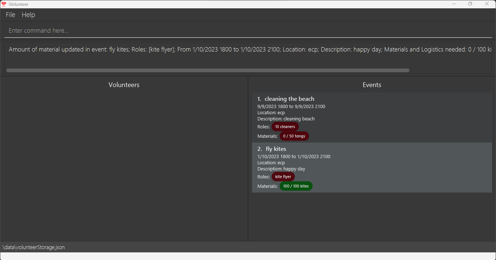

# AB-3 User Guide

AddressBook Level 3 (AB3) is a **desktop app for managing contacts, optimized for use via a  Line Interface** (CLI) while still having the benefits of a Graphical User Interface (GUI). If you can type fast, AB3 can get your contact management tasks done faster than traditional GUI apps.

<!-- * Table of Contents -->
<page-nav-print />

--------------------------------------------------------------------------------------------------------------------

## Quick start

1. Ensure you have Java `11` or above installed in your Computer.

1. Download the latest `addressbook.jar` from [here](https://github.com/se-edu/addressbook-level3/releases).

1. Copy the file to the folder you want to use as the _home folder_ for your AddressBook.

1. Open a command terminal, `cd` into the folder you put the jar file in, and use the `java -jar addressbook.jar` command to run the application. 
   A GUI similar to the below should appear in a few seconds. Note how the app contains some sample data. 
   

1. Type the command in the command box and press Enter to execute it. e.g. typing **`help`** and pressing Enter will open the help window. 
   Some example commands you can try:

   * `list` : Lists all contacts.

   * `add n/John Doe p/98765432 e/johnd@example.com a/John street, block 123, #01-01` : Adds a contact named `John Doe` to the Address Book.

   * `delete 3` : Deletes the 3rd contact shown in the current list.

   * `clear` : Deletes all contacts.

   * `exit` : Exits the app.

1. Refer to the [Features](#features) below for details of each command.

--------------------------------------------------------------------------------------------------------------------

## Features

<box type="info" seamless>

**Notes about the command format:** 

* Words in `UPPER_CASE` are the parameters to be supplied by the user. 
  e.g. in `add n/NAME`, `NAME` is a parameter which can be used as `add n/John Doe`.

* Items in square brackets are optional. 
  e.g `n/NAME [t/TAG]` can be used as `n/John Doe t/friend` or as `n/John Doe`.

* Items with `…`​ after them can be used multiple times including zero times. 
  e.g. `[t/TAG]…​` can be used as ` ` (i.e. 0 times), `t/friend`, `t/friend t/family` etc.

* Parameters can be in any order. 
  e.g. if the command specifies `n/NAME p/PHONE_NUMBER`, `p/PHONE_NUMBER n/NAME` is also acceptable.

* Extraneous parameters for commands that do not take in parameters (such as `help`, `list`, `exit` and `clear`) will be ignored. 
  e.g. if the command specifies `help 123`, it will be interpreted as `help`.

* If you are using a PDF version of this document, be careful when copying and pasting commands that span multiple lines as space characters surrounding line-breaks may be omitted when copied over to the application.
</box>

### Viewing help : `help`

Shows a message explaning how to access the help page.

Format: `help`

### Adding a person: `add`

Adds a person to the address book.

Format: `add n/NAME p/PHONE_NUMBER e/EMAIL a/ADDRESS [t/TAG]…​`

<box type="tip" seamless>

**Tip:** A person can have any number of tags (including 0)
</box>

Examples:
* `add n/John Doe p/98765432 e/johnd@example.com a/John street, block 123, #01-01`
* `add n/Betsy Crowe t/friend e/betsycrowe@example.com a/Newgate Prison p/1234567 t/criminal`

### Listing all persons : `list`

Shows a list of all persons in the address book.

Format: `list`

### Editing a person : `edit`

Edits an existing person in the address book.

Format: `edit INDEX [n/NAME] [p/PHONE] [e/EMAIL] [a/ADDRESS] [t/TAG]…​`

* Edits the person at the specified `INDEX`. The index refers to the index number shown in the displayed person list. The index **must be a positive integer** 1, 2, 3, …​
* At least one of the optional fields must be provided.
* Existing values will be updated to the input values.
* When editing tags, the existing tags of the person will be removed i.e adding of tags is not cumulative.
* You can remove all the person’s tags by typing `t/` without
    specifying any tags after it.

Examples:
*  `edit 1 p/91234567 e/johndoe@example.com` Edits the phone number and email address of the 1st person to be `91234567` and `johndoe@example.com` respectively.
*  `edit 2 n/Betsy Crower t/` Edits the name of the 2nd person to be `Betsy Crower` and clears all existing tags.

### Locating persons by name: `find`

Finds persons whose names contain any of the given keywords.

Format: `find KEYWORD [MORE_KEYWORDS]`

* The search is case-insensitive. e.g `hans` will match `Hans`
* The order of the keywords does not matter. e.g. `Hans Bo` will match `Bo Hans`
* Only the name is searched.
* Only full words will be matched e.g. `Han` will not match `Hans`
* Persons matching at least one keyword will be returned (i.e. `OR` search).
  e.g. `Hans Bo` will return `Hans Gruber`, `Bo Yang`

Examples:
* `find John` returns `john` and `John Doe`
* `find alex david` returns `Alex Yeoh`, `David Li` 
  

### Deleting a person : `delete`

Deletes the specified person from the address book.

Format: `delete INDEX`

* Deletes the person at the specified `INDEX`.
* The index refers to the index number shown in the displayed person list.
* The index **must be a positive integer** 1, 2, 3, …​

Examples:
* `list` followed by `delete 2` deletes the 2nd person in the address book.
* `find Betsy` followed by `delete 1` deletes the 1st person in the results of the `find` command.

### Clearing all entries : `clear`

Clears all entries from the address book.

Format: `clear`

### Exiting the program : `exit`

Exits the program.

Format: `exit`

### Saving the data

AddressBook data are saved in the hard disk automatically after any command that changes the data. There is no need to save manually.

### Editing the data file

AddressBook data are saved automatically as a JSON file `[JAR file location]/data/addressbook.json`. Advanced users are welcome to update data directly by editing that data file.

<box type="warning" seamless>

**Caution:**
If your changes to the data file makes its format invalid, AddressBook will discard all data and start with an empty data file at the next run.  Hence, it is recommended to take a backup of the file before editing it.
</box>

### Archiving data files `[coming in v2.0]`

_Details coming soon ..._

--------------------------------------------------------------------------------------------------------------------

## FAQ

**Q**: How do I open the iVolunteer app?

**A**: Refer to the [Quick Start](#quick-start) above for instructions on how to install and open our application.

--------------------------------------------------------------------------------------------------------------------

## Known issues

1. **Coming soon**
--------------------------------------------------------------------------------------------------------------------

## Command summary

Other commands are **coming soon**!

| Action                                           | Format(s), Examples                                                                                                                                                                                                                                                                                                                                                                                                       |
|--------------------------------------------------|---------------------------------------------------------------------------------------------------------------------------------------------------------------------------------------------------------------------------------------------------------------------------------------------------------------------------------------------------------------------------------------------------------------------------|
| **Add a new event**                              | `event add n/EVENT_NAME r/ROLES_NEEDED... d/DATE_AND_TIME l/LOCATION dsc/DESCRIPTION [m/MATERIALS_AND_LOGISTICS_NEEDED]... [b/BUDGET]`   e.g., `n/food donation r/chef r/packer d/23-9-2023 1500 dsc/help food distribution m/50 potatoes b/$50`   Abbreviations for `event add` are `e add` and `ea`.                                                                                                              |
| **List all events**                              | `event list`   Abbreviations for `event list` are `e list` and `el`.                                                                                                                                                                                                                                                                                                                                                   |
| **List an individual event**                     | `event show EVENT_NUMBER`   e.g., `event show 8`   Abbreviations for `event show` are `e show` and `es`.                                                                                                                                                                                                                                                                                                            |
| **Delete event listing**                         | `event delete EVENT_NUMBER`   e.g.,`event delete 8`   Abbreviations for `event delete` are `e delete` and `ed`.                                                                                                                                                                                                                                                                                                     |
| **Check volunteers that signed up for an event** | `volunteer list eid/EVENT_ID`  e.g., `volunteer list eid/8`   Alternatively, `volunteer list en/EVENT_NAME`   e.g., `volunteer list en/Food Drive in October`   Abbreviations for `volunteer list` are `v list` and `vl`.                                                                                                                                                                                     |
| **Add a volunteer to an event**                  | `volunteer add vn/VOLUNTEER_NAME hp/PHONE_NUMBER e/EMAIL /to eid/EVENT_ID`   e.g., `volunteer add vn/John hp/12345678 e/john123@gmail.com /to eid/8`   Alternatively, `volunteer add vn/VOLUNTEER_NAME hp/PHONE_NUMBER e/EMAIL /to en/EVENT_NAME`   e.g., `volunteer add vn/John hp/12345678 e/john123@gmail.com /to en/Volunteering at Sparketots`   Abbreviations for `volunteer add` are `v add` and `va`. |
| **Delete a volunteer from an event**             | `volunteer delete vn/VOLUNTEER_NAME id/VOLUNTEER_ID /from eid/EVENT_ID`   e.g., `volunteer delete vn/John id/8 /from eid/4`  `volunteer delete vn/VOLUNTEER_NAME id/VOLUNTEER_ID /from en/EVENT_NAME`   e.g., `volunteer delete vn/John id/1 /from en/Volunteering at Sparkletots`   Abbreviations for `volunteer delete` are `v delete` and `vd`.                                                            |
| **Add a volunteer to the database**              | `volunteer create vn/VOLUNTEER_NAME hp/PHONE_NUMBER e/EMAIL`   e.g., `volunteer create vn/Cyrus hp/12345678 e/robot123@gmail.com`   Abbreviations for `volunteer create` are `v create` and `vc`.                                                                                                                                                                                                                   |

